# HANDOFF — FC IG Lead Discovery

> **Goal of this doc:** a new developer can clone the repo, follow this top-to-bottom, and have the pipeline running within **60 minutes** on a fresh machine.

| | |
|---|---|
| **Incoming developer** | TBD |
| **Status** | Operator-mode V1, validated end-to-end on 2026-06-24 |
| **Last updated** | 2026-06-24 |

---

## ⚠️ 0. CRITICAL READ-ME-FIRST: The IG burner is the bottleneck *(2 min)*

**This system is technically complete and architecturally sound. Every code path has been validated end-to-end. The thing that gates real-world output is not the code — it's the Instagram burner account it drives.**

Before doing anything else, the incoming developer needs to understand:

### What the system needs to actually produce leads

It needs **one healthy Instagram burner account** that can do read-only IG actions (profile lookups, hashtag scrapes, tagged-photo crawls, inbox polls) without getting soft-blocked. "Healthy" means:

- Created on a **real phone**, on **cellular data** (not a VPS, not a desktop browser)
- **Warmed manually for 5–7 days** before being plugged in — real bio, real profile photo, 2–3 real posts, scrolling, occasional likes, a few genuine follows in the target niche
- Lives on a **clean residential or mobile IP** the entire time (no datacenter proxies, no shared IPs)
- Carries **its own dedicated proxy** in the `ig_accounts.proxy_endpoint` JSON column once plugged in

### Where the project is right now

The original burner — `ignorethisdump2` — is **shadow-restricted**. Throughout the 2026-06-24 build day:

- Profile-info reads (`/users/web_profile_info`) succeed
- Tagged-photo feed reads (`/usertags/.../feed/`) get rate-limited within seconds on high-profile accounts
- Hashtag scrapes (`/tags/.../sections/`) trigger soft-block + 48h cooldown within ~8 seconds

This account is functionally cooked for live discovery work. **Until a fresh, properly-warmed burner is plugged in, no real prospects will flow through the pipeline** — regardless of how many seeds you add to `crawl_queue` or how many hashtags you add to `hashtags`.

### What this means for your first week

1. **Days 1–2:** Read this handoff. Stand up the stack locally per section 3 below. Validate the architecture works using existing test fixtures (the smoke test in section 3.6 does not require a working burner).
2. **Days 1–7 (in parallel):** Acquire and warm a fresh burner on a real phone. See `docs/burner_warmup_protocol.md` once that doc exists (it doesn't yet — see TBD section). For now: create an IG account on cellular data, post 2–3 real things, follow ~20 real accounts in your target niche, scroll daily for 5–7 days.
3. **Day ~7:** Capture the warmed burner's session cookies via `python scripts/capture_session.py --handle <new_handle>`, insert the row into `ig_accounts`, and watch real discovery flow for the first time.

The system was built for this moment. Day-1 expectation is **stack health**, not lead volume.

### What this also means: operator mode is the safety net

To minimize burner risk, the system was redesigned mid-build so that **all IG write actions** (follow, like, comment, story view, DM send, reply send) go through Discord cards to an operator, who executes them by hand on their personal IG app. Only IG READS still use the burner. This is called **operator mode**, and it's the default. Section 7 explains the workflow.

---

## 1. Project Overview *(2 min read)*

**What it does:** Discovers high-fit business owners on Instagram, researches them across TikTok + IG + YouTube + their website, scores them with a multi-signal qualifier, generates Mason-style S.I.P.E. cold openers via Claude, and surfaces a queue of pre-researched, pre-written DM opportunities to a human operator via Discord. The human operator does the actual Instagram clicking; the system does all the thinking.

**Why it exists:** Implements "Mason's Way" — a specific cold-outreach methodology that prioritizes intentional, vibe-matched, gap-aware DMs over volume blasting. The market problem: Mason's playbook works but doesn't scale beyond ~20 DMs/day for one person. This system industrializes the research + writing layer while keeping the human-on-IG layer that prevents bans.

**What it is *not*:**
- It is **not** a fully autonomous DM bot. Every send is operator-approved and operator-clicked.
- It is **not** a scraper for cold lead lists. It produces ~10-30 hand-tailored prospects per day, not 10,000.
- It is **not** a CRM. Once a conversation lands a meeting, the human takes over outside the system.

---

## 2. TL;DR — One-Command Run *(read first, validate at end)*

If sections 3.1–3.5 are done, the entire stack runs with:

```bash
docker compose up -d && docker compose logs --tail=30 -f
```

Expected runtime: **starts in ~10 seconds, runs continuously**.

Expected output: 9 containers in `Up` state, each producing one log line per poll cycle (every 30s to 5min depending on worker). When work exists, Discord channels receive cards within 60s.

If this command doesn't bring up 9 healthy containers, treat it as a bug and update this doc.

---

## 3. Setup Instructions *(estimated: 45–60 min on a fresh machine)*

Assumes: a clean **Ubuntu 22.04 LTS** machine (or WSL2 Ubuntu on Windows) with sudo access and an internet connection.

### 3.1 System dependencies *(5 min)*

```bash
sudo apt-get update
sudo apt-get install -y \
    git \
    curl \
    ca-certificates \
    python3.11 \
    python3.11-venv \
    python3-pip
```

Install Docker Engine + Compose plugin (modern way):

```bash
curl -fsSL https://get.docker.com | sudo sh
sudo usermod -aG docker $USER
newgrp docker
```

**Verify:**
```bash
python3.11 --version    # → Python 3.11.x
docker --version        # → Docker version 24.x or newer
docker compose version  # → Docker Compose version v2.x or newer
```

### 3.2 Clone and inspect repo *(2 min)*

```bash
# If you have the .rar file:
unrar x fc-ig-lead-discovery.rar
cd fc-ig-lead-discovery

# Or if a git remote exists now:
# git clone <url>
# cd fc-ig-lead-discovery
```

**Verify:**
```bash
ls migrations/ app/ docker/ scripts/
```
Expected: at least `001_initial_schema.sql` through `006_operator_mode.sql` in `migrations/`, an `app/` tree, a `docker/Dockerfile`, and a `scripts/capture_session.py`.

### 3.3 Provision external services *(20 min — most of setup time)*

The system depends on five external services. Stand them up in this order:

#### a) Supabase (Postgres + REST API)

1. Create a free project at https://supabase.com/dashboard
2. Open SQL Editor → paste each migration in order:
   - `001_initial_schema.sql`
   - `002_mason_corpus.sql` (then `002_opener_review.sql`)
   - `003_celebrity_dq.sql`
   - `004_warming_action_discord.sql`
   - `005_seed_hashtags.sql`
   - `006_operator_mode.sql`
3. From Settings → API, copy: `Project URL`, `service_role` key, `anon` key

**Verify:**
```sql
SELECT table_name FROM information_schema.tables
WHERE table_schema = 'public' ORDER BY table_name;
```
Expected: ~20 tables including `accounts`, `conversations`, `crawl_queue`, `hashtags`, `ig_accounts`, `openers`, `pending_outbound_messages`, `qualified_prospects`, `warming_actions`.

#### b) Anthropic API

1. Create an account at https://console.anthropic.com
2. Settings → API Keys → Create Key, save as `sk-ant-...`
3. Optional: add a $20 credit balance for solo testing; the system burns ~$0.50–$2/day in normal operation.

**Verify:**
```bash
curl https://api.anthropic.com/v1/messages \
  -H "x-api-key: $YOUR_KEY" \
  -H "anthropic-version: 2023-06-01" \
  -H "content-type: application/json" \
  -d '{"model":"claude-haiku-4-5-20251001","max_tokens":10,"messages":[{"role":"user","content":"hi"}]}'
```
Expected: a 200 response containing a `content` block.

#### c) Discord bot + server

1. https://discord.com/developers/applications → New Application
2. Bot tab → Reset Token, save it. Enable `MESSAGE CONTENT INTENT`.
3. OAuth2 → URL Generator → check `bot` + `applications.commands`. Permissions: Send Messages, Embed Links, Use Slash Commands.
4. Visit the generated URL, add the bot to your server.
5. In Discord client: Settings → Advanced → Developer Mode = ON. Right-click your server → Copy Server ID. Right-click your target channel → Copy Channel ID.

**Verify:** the bot appears in your server's member list (it'll show as offline until step 3.6).

#### d) YouTube Data API v3

1. https://console.cloud.google.com → new project
2. APIs & Services → Enable APIs → search "YouTube Data API v3" → Enable
3. Credentials → Create Credentials → API Key

**Verify:**
```bash
curl "https://www.googleapis.com/youtube/v3/search?part=snippet&q=test&key=$YOUR_KEY&maxResults=1"
```
Expected: JSON with an `items` array.

#### e) Residential proxy *(skip for Day-1 dry-run, required before live IG reads)*

Recommended providers: Bright Data, IPRoyal, Smartproxy. Get one **mobile or residential** endpoint per burner you plan to run. Datacenter proxies will get the burner banned within minutes.

**Verify:** wait until step 3.7.

### 3.4 Configure environment *(5 min)*

```bash
cp /mnt/user-data/outputs/.env.example .env   # use the corrected version from this handoff bundle
$EDITOR .env
```

Fill in every value. Generate the Fernet key:

```bash
python3 -c "from cryptography.fernet import Fernet; print(Fernet.generate_key().decode())"
```

Required fields (no defaults):
- `SUPABASE_URL`, `SUPABASE_SERVICE_ROLE_KEY`, `SUPABASE_ANON_KEY`
- `ANTHROPIC_API_KEY`
- `FERNET_KEY`
- `DISCORD_BOT_TOKEN`, `DISCORD_GUILD_ID`, `DISCORD_WARMING_QUEUE_CHANNEL_ID`, `DISCORD_HANDOFF_CHANNEL_ID`
- `YOUTUBE_API_KEY`

Strongly recommend keeping `TEST_MODE=true` and `RATE_LIMIT_SAFETY_FACTOR=0.2` for the first 2 weeks.

**Verify:**
```bash
grep -cE "^[A-Z_]+=.+$" .env    # → at least 15
grep -E "^[A-Z_]+=$" .env       # should print nothing (every required var has a value)
```

### 3.5 Build and start the stack *(5 min)*

```bash
docker compose build
docker compose up -d
sleep 15
docker compose ps
```

**Verify:** 9 containers all show `Up` status:
- `fc_ig_api`, `fc_ig_discord`, `fc_ig_scheduler`
- `fc_ig_worker_disc`, `fc_ig_worker_qual`, `fc_ig_worker_warm`, `fc_ig_worker_conv`
- `fc_ig_worker_opener`, `fc_ig_worker_opener_gen`

If any are in `Restarting`, tail their logs: `docker compose logs --tail=30 <service_name>`.

### 3.6 Smoke test *(3 min — does NOT require a working burner)*

```bash
docker compose exec api python scripts/smoke_test.py
```

Expected output (excerpt):
```
✅ Supabase connection OK (20 tables)
✅ Anthropic API reachable
✅ YouTube API quota: <number> units remaining
✅ Discord bot online
✅ Fernet roundtrip OK
✅ All 9 containers healthy
```

Then verify the Discord bot is alive and command-synced:
```bash
docker compose logs --tail=10 discord_bot | grep -E "ready|commands_synced"
```
Expected: a `ready` line and `commands_synced count=20 scope="guild"`.

If you got here, the stack is operational. The remaining gap is the burner (see section 0).

### 3.7 Plug in a burner *(only after section 0 burner-warming is done)*

```bash
# From a Windows or Mac machine with a real browser session logged into the burner:
python scripts/capture_session.py --handle <burner_handle>
```

Then SQL-insert the row in Supabase:
```sql
INSERT INTO ig_accounts (handle, current_status, proxy_endpoint, daily_caps)
VALUES ('<burner_handle>', 'active',
        '{"host":"...","port":"...","user":"...","pass":"..."}'::jsonb,
        '{"hashtag_pages":10,"profile_loads":100,"follows":5,"likes":15,"dms_sent":3}'::jsonb);
```

**Verify:** within 5 minutes, `worker_disc` logs should show `m1.worker.start` and an attempt to claim from `crawl_queue` if it has pending rows.

---

## 4. Dependency Map

### System / OS
- Ubuntu 22.04 LTS (or WSL2 Ubuntu on Windows)
- Docker Engine 24+ with Compose plugin
- Python 3.11 (for host-side scripts like `capture_session.py`)
- `unrar` (one-time, to extract the project archive)

### Language packages
Pinned in `pyproject.toml`. Top-level:
- `anthropic` — Claude SDK
- `supabase` + `postgrest` — DB client
- `discord.py` — bot
- `playwright` — IG read automation
- `fastapi` + `uvicorn` — internal API
- `apscheduler` — cron loops
- `pydantic-settings` — env-var parsing
- `cryptography` (Fernet) — session-cookie encryption

### External services
- **Supabase** — Postgres + REST. Holds all state. Free tier sufficient for one-burner operation.
- **Anthropic Claude API** — opener generation, agent reasoning, qualification. ~$0.50–2/day.
- **Discord** — operator queue + handoffs surface (M8).
- **YouTube Data API v3** — cross-platform research (M3). Free tier covers it.
- **Residential/mobile proxy provider** — one endpoint per burner.
- **Instagram** (no API; Playwright + cookies) — the read target.

### Secrets / credentials *(names only — values live in `.env`)*
- `SUPABASE_SERVICE_ROLE_KEY` — full DB read/write
- `ANTHROPIC_API_KEY` — Claude billing
- `FERNET_KEY` — encrypts IG session cookies at rest; **losing this loses every burner**
- `DISCORD_BOT_TOKEN` — bot identity
- `YOUTUBE_API_KEY` — M3 cross-platform calls
- `DEFAULT_PROXY_*` — fallback proxy creds (per-burner proxies live in `ig_accounts.proxy_endpoint` JSON)

---

## 5. Architecture Diagram

```mermaid
flowchart LR
    SEEDS["/seed_add<br/>/hashtag_add<br/>(Discord)"] --> CQ[(crawl_queue<br/>hashtags)]

    CQ --> M1[M1 tagged crawler<br/>worker_disc]
    CQ --> M2[M2 hashtag scraper<br/>worker_disc]

    M1 --> ACC[(accounts)]
    M2 --> ACC

    ACC --> M3[M3 cross-platform<br/>research<br/>worker_qual]
    M3 --> M4[M4 qualifier+scorer<br/>worker_qual]
    M4 --> QP[(qualified_prospects)]

    QP --> M5[M5 warmup planner<br/>worker_warm]
    QP --> M6[M6 opener generator<br/>worker_opener_gen]

    M5 --> WA[(warming_actions<br/>status=skipped_human_queue)]
    M6 --> OP[(openers<br/>approved_for_send=true)]

    WA --> BOT[Discord bot<br/>m8/discord_bot]
    OP --> BOT

    BOT -->|"🟢 Follow / 💛 Like /<br/>💬 Comment / 📨 DM cards"| OPERATOR((👤 Operator<br/>does it on IG app))

    OPERATOR -->|/follow_done /dm_sent /reply_sent| BOT
    OPERATOR -.->|IG inbox poll| M7[M7 conversation engine<br/>worker_conv]
    M7 --> POM[(pending_outbound_messages)]
    POM --> BOT
    M7 --> HO[(handoffs)]
    HO --> BOT
```



**Data flow narrative:** Operator seeds handles/hashtags via Discord slash commands. M1 fans out from seed handles via tagged-photo crawls; M2 scrapes hashtags. Both write to `accounts`. M3 enriches each account across TikTok + IG + YouTube + their website, then M4 scores them. Above threshold goes to `qualified_prospects`. M5 plans warmup actions (follow/like/comment/story); M6 drafts SIPE openers via Claude. Both push to Discord as operator cards. The operator executes IG-write actions by hand and slash-commands confirmation back. When a prospect replies, M7 detects via inbox poll, runs Claude with Mason's Selling Map, drafts a reply, and either queues it as a `pending_outbound_messages` card or escalates to a `handoff` if confidence is low or validator rules fire.

---

## 6. Compute Requirements

| Resource | Minimum | Recommended |
|---|---|---|
| CPU | 2 vCPU | 4 vCPU |
| RAM | 2 GB | 4 GB |
| GPU | none | none |
| Disk | 15 GB | 30 GB (logs grow) |
| Network | residential or mobile-routed proxy for IG reads | dedicated proxy per burner |

**Runs on:** the current install is a Hostinger VPS (2 vCPU / 4 GB RAM / 80 GB disk, Ubuntu 22.04). Could run on any Docker host of similar size.

**Cost (rough, monthly, for one-burner operation):**
- Hostinger VPS: $7
- Supabase free tier: $0
- Anthropic Claude: $15–60
- YouTube API: $0 (free tier)
- Residential proxy: $15–40
- Discord: $0
- **Total: ~$35–110/mo**

---

## 7. Operational Runbook

### Start
```bash
docker compose up -d
```

### Stop / clean shutdown
```bash
docker compose down
```

### Restart a single service after a patch
```bash
docker compose build --no-cache <service_name>
docker compose up -d <service_name>
```

### Monitor while running
- **Logs (all services):** `docker compose logs --tail=50 -f`
- **Logs (one service):** `docker compose logs --tail=30 -f worker_disc`
- **Health snapshot:** `docker compose ps` — all 9 should be `Up`
- **Live queue check:** in Discord, type `/queue_all` → ephemeral reply with pending counts

**What "healthy" looks like:**
- `worker_disc` logs `m1.worker.idle` or `m2.scrape.start` every 30–120s
- `worker_qual` logs nothing if no new accounts to enrich (normal — wakes when discovery produces)
- `discord_bot` logs `m8.discord.ready` once at startup, then poller HTTP/200s every 30s
- `scheduler` logs `apscheduler.executors.default: Running job ...` periodically

### The operator's daily workflow

1. Open Discord. Glance at the channel for new cards.
2. For each card:
   - **🟢 Follow / 💛 Like / ❤️ Story / 💬 Comment** → do the action on your phone in IG. Run `/follow_done <id>` / `/like_done <id>` / `/comment_done <id>`.
   - **📨 SEND DM** → long-press the opener text in the card to copy, open IG, paste into a DM to the named handle, send. Run `/dm_sent <opener_id>`.
   - **💬 INBOUND REPLY** → AI has drafted a response. Copy from card, paste in IG, send. Run `/reply_sent <pending_id>`. If the draft is wrong, use `/reply_edit <pending_id> text:<your version>`.
   - **🚨 HANDOFF** → AI escalated; the prospect needs your judgment. Run `/claim <handoff_id>`, write your own reply, then `/resolve <handoff_id> notes:"..."`.
3. To add new seeds: `/seed_add handles:<comma-list> niche:<text>` or `/hashtag_add tags:<comma-list> niche:<text>`.
4. To see what's pending at any moment: `/queue_all`.

### Common failures *(observed during 2026-06-24 build day)*

| Symptom | Likely cause | Fix |
|---|---|---|
| `worker_conv` logs `m7.worker.no_active_ig_accounts — sleeping` repeatedly | Burner is in cooldown | `UPDATE ig_accounts SET current_status='active', cooldown_until=NULL WHERE handle='<burner>';` (only safe if cooldown was triggered erroneously — otherwise rotate burners) |
| `worker_disc` logs `ig.tagged.fetch_failed` / `m2.rate_limited_by_ig` | IG is throttling this burner | Lower `RATE_LIMIT_SAFETY_FACTOR` to 0.1 and lengthen scheduler intervals. If recurring, the burner is cooked — warm a new one. |
| Discord shows duplicated slash commands (each appears twice) | Bot was synced globally before guild-scope was added | `docker compose exec discord_bot python scripts/clear_global_commands.py` then refresh Discord client (Ctrl+R) |
| Slash commands don't appear in autocomplete | `DISCORD_GUILD_ID` not set, so sync is global (up to 1h delay) | Set `DISCORD_GUILD_ID` in `.env`, `docker compose up -d --force-recreate discord_bot` |
| `postgrest.exceptions.APIError: column ... does not exist` | A migration didn't run | Run the missing migration in Supabase SQL editor |
| `httpx.ConnectError: SSL: UNEXPECTED_EOF_WHILE_READING` | Transient network blip to Supabase | Ignore; worker auto-recovers next cycle |
| `m1.profile.not_found` for a handle you know exists | Handle was misspelled or banned | Verify the handle on instagram.com manually; remove from `crawl_queue` |
| All cards stop appearing in Discord | Bot disconnected from gateway | `docker compose restart discord_bot` |
| Opener cards render but operator's IG can't find the prospect | Prospect deactivated/blocked between discovery and DM | Run `/dm_issue <opener_id> reason:"account gone"` |

### Escalation
If stuck for more than 30 minutes, contact **Jon Yuzon** (FascinateCopy founder). Method: Slack DM in the FC workspace, or email via fascinatecopy.com contact form.

---

## 8. Troubleshooting & FAQ

**Q: Where do I add new niche handles or hashtags to scrape?**
A: In Discord. `/seed_add handles:bob,jane niche:health_coaching` adds to `crawl_queue` (M1 tagged crawler). `/hashtag_add tags:hormonecoach,perimenopause niche:health_coaching` adds to `hashtags` (M2 scraper). You can also paste rows directly in Supabase Studio.

**Q: How many DMs/day is safe per burner?**
A: 3–5/day for the first 2 weeks of a new burner. 10–15/day once warm. **Never above 30/day** — that's the IG report-and-ban threshold even on healthy accounts.

**Q: How do I review and approve openers before they go out?**
A: Set `approved_for_send=false` in M6 by default (currently it auto-approves for solo use). To toggle a single opener on/off, edit the row in Supabase Studio `openers` table. The Discord bot only posts cards where `approved_for_send=true`.

**Q: What's "Mason's Way"?**
A: The cold-DM methodology this system implements. S.I.P.E. = Short, Incomplete, Personal, Emotional. Openers reference a specific gap detected in the prospect's business and end on a curiosity-creating question. The conversation engine (M7) follows a Selling Map: opener → escalation → invitation → action.

**Q: Why operator mode instead of letting the system DM directly?**
A: Instagram aggressively bans accounts that DM via Playwright/automation. By having the AI do the thinking and a real human do the IG clicking, the burner only does IG reads (which are far less risky). This trades scale for sustainability.

**Q: How do I rotate burners?**
A: Set the old burner's `current_status='retired'`. Capture a new burner's cookies with `python scripts/capture_session.py --handle <new>`. Insert the new row into `ig_accounts` with `current_status='active'`. Conversations in flight keep working — they're tied to `prospect_id`, not burner.

**Known limitations / hacks the new dev must know:**

- **M9 dashboard is empty.** The directory and reference exist but no actual UI was built. The `DASHBOARD_*` env vars are vestigial — they were removed from `.env.example` as part of this handoff cleanup.
- **n8n integration was scaffolded but unused.** `N8N_*` env vars were also removed from `.env.example`. There is no n8n dependency in the running code.
- **No automatic burner-health monitoring.** A burner can be soft-blocked and you'll only see it via `worker_conv` logging "no_active_ig_accounts". Worth building a `/burner_status` slash command.
- **Cookie encryption uses one Fernet key for all burners.** Losing `FERNET_KEY` means re-capturing every burner session. Back it up in a password manager.
- **The IG session capture script (`scripts/capture_session.py`) requires Playwright with a visible browser** — run it on a machine with a display, not on the VPS.
- **Migrations are not versioned/checksummed.** Run each one once, in order. Don't re-run.
- **Test mode is sticky.** If you forget `TEST_MODE=true` is set, M1/M2 will silently stop discovering after 10 accounts. Set `TEST_MODE=false` only when you're sure.

> ⚠️ **TBD — needs follow-up:**
> - A `docs/burner_warmup_protocol.md` doc covering exactly what to do on a phone for 5–7 days to warm a burner. The verbal protocol exists in Jon's head but isn't written down.
> - A repo remote (Git host). Currently the project lives as a local .rar archive. Push to a private GitHub repo before handing off.
> - A backup of `FERNET_KEY` to a secure password manager. Loss is irrecoverable.

---

## 9. Handoff Checklist

Incoming developer, tick these off before the outgoing developer disengages:

- [ ] Read section 0 (the burner limitation) in full
- [ ] Cloned the repo and ran section 3 setup successfully
- [ ] Smoke test (3.6) passes — all 9 containers Up
- [ ] Discord bot online, shows `commands_synced count=20 scope="guild"`
- [ ] Typed `/queue_all` in Discord, got an ephemeral reply
- [ ] Can read and interpret the architecture diagram
- [ ] Have credentials for every secret in section 4 (Supabase, Anthropic, Discord, YouTube, proxy)
- [ ] `FERNET_KEY` backed up to a password manager
- [ ] Walked through the runbook (section 7) live with Jon
- [ ] Triggered at least one common-failure fix from section 7's table
- [ ] Acquired or planned the acquisition of a fresh IG burner
- [ ] Know the escalation contact (Jon Yuzon, FascinateCopy)
- [ ] All `⚠️ TBD` markers in section 8 acknowledged

Once all boxes are ticked, the handoff is complete. Commit any updates to this file as your first PR.
